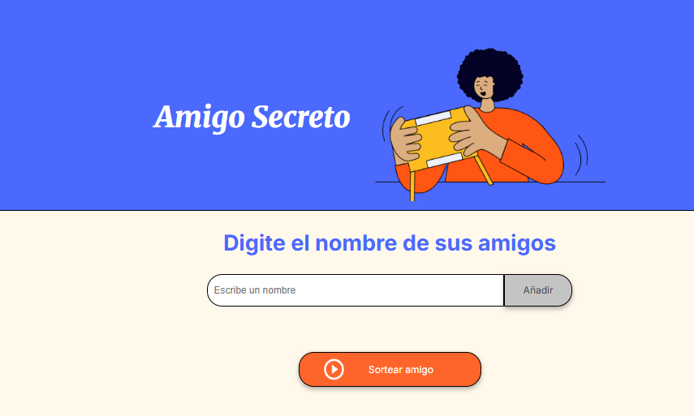
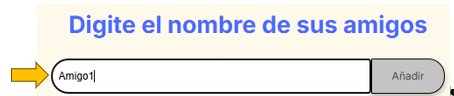
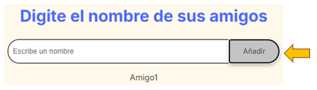

  <h1 align="center">
    Challenge Amigo Secreto
     
         
        
  </h1>

## Introducción

El juego del Amigo Secreto consiste en ingresar los nombres de amigos para que
posteriormente sean sorteados 

## Como funciona
### Paso 1
Ingresa en el campo de texto el nombre del amigo
 

### Paso 2
Da clic en el boton Añadir y se agrega a li lista de amigos que es vizualizada 
abajo del campo de texto. Así puedes seguir agregando amigos.
 

## Paso 3
Una vez que ya has agregado todos tus amigos, puedes dar clic en el boton
Sortear amigo, con esto te mostrara quien es tu amigo secreto.
 

## Herramientas utilizadas
HTML 5
CSS
Java Script

## Autor
Aldo Yael Pablo Rodríguez
